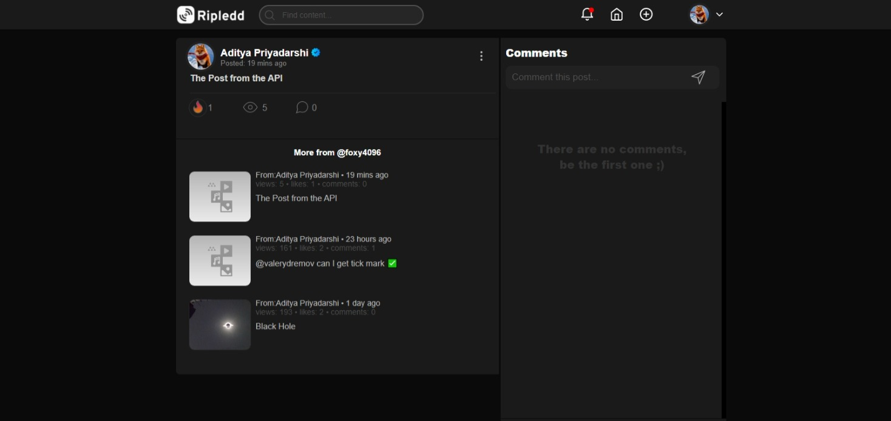

# Ripledd Python

A simple API wrapper made for [Ripledd](https://ripledd.com/center/).


## **Install It**

```
pip install ripledd-python
```


## **Write Some Code** 


```py
# demo.py

# Load the Important Modules

# Load the Important Modules
import os

from dotenv import load_dotenv

from ripledd import Ripledd

# Loading the Enviroment Variables
load_dotenv()

# Assigining then a constant
EMAIL = os.environ.get("RIPLEDD_EMAIL")
PASSWORD = os.environ.get("RIPLEDD_PASSWORD")
CHANNEL_ID = os.environ.get("RIPLEDD_CHANNEL_ID")

# Creating a Ripledd Object
ripledd = Ripledd(email=EMAIL, password=PASSWORD, channel_id=CHANNEL_ID)

# Printing the success
print(ripledd.create_post("Django: The web framework for perfectionists with deadlines.").json())


```

## **Run it**

```ps
PS C:\Users\ripledd\Projects\Bots>python demo.py
```

## **Response**

You will get the following response




*Cheers ✌*